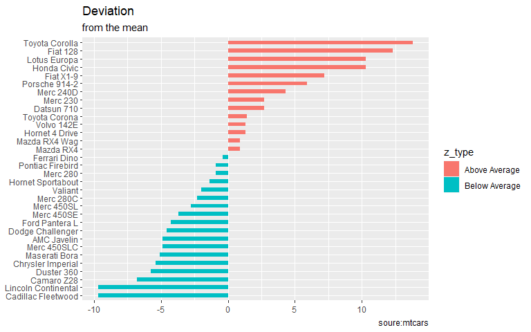
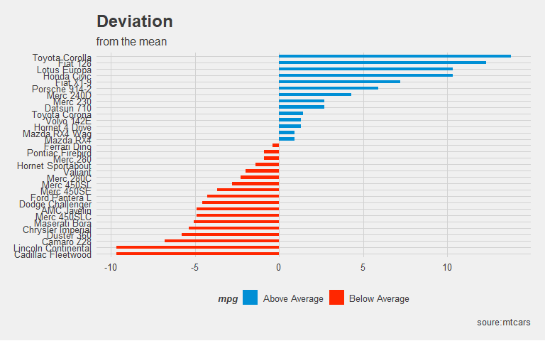
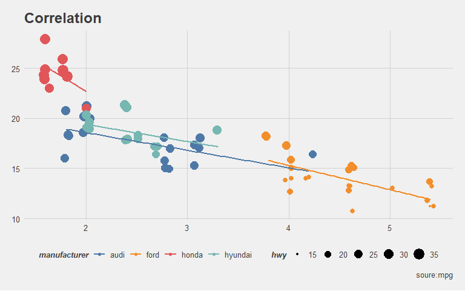
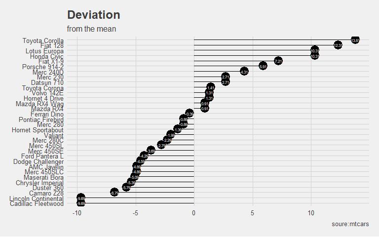
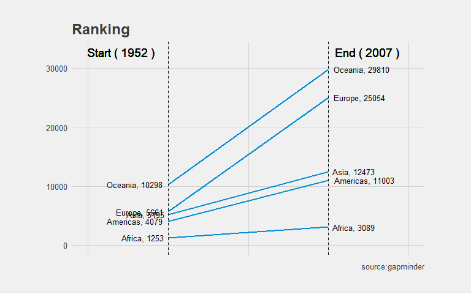
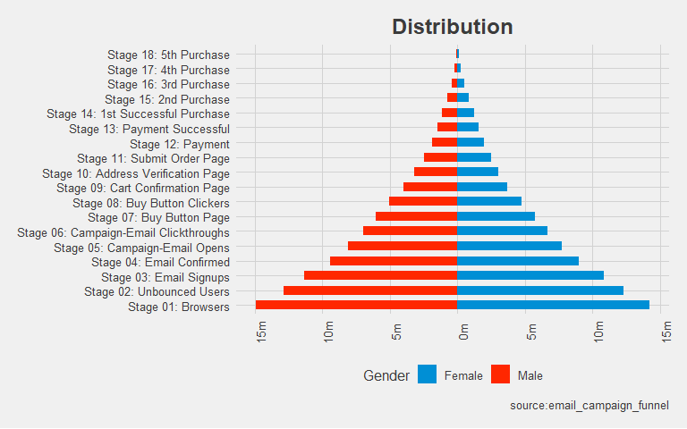
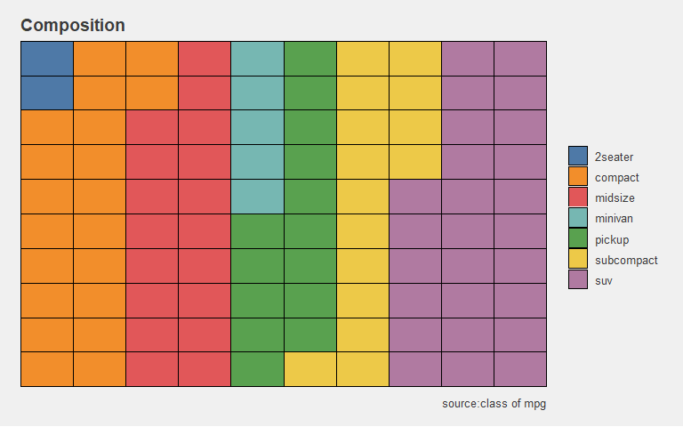
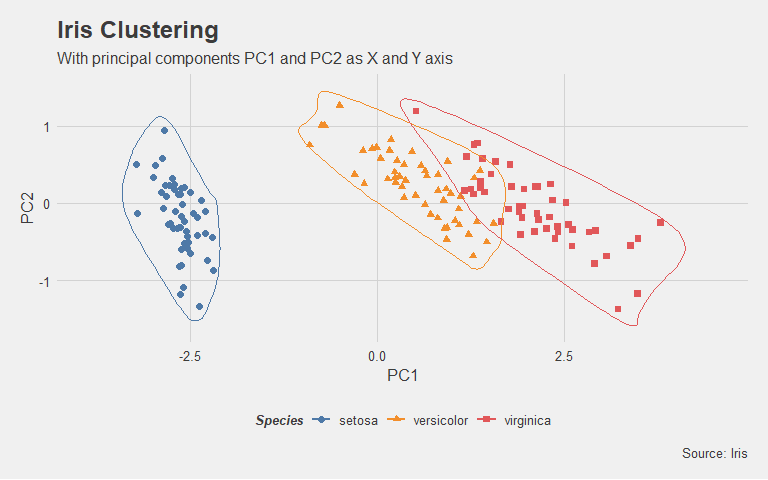

<!-- README.md is generated from README.Rmd. Please edit that file -->

## Overview

`{ggedachart}`는 `{ggplot2}`인터페이스를 이용하여 EDA 과정에서 필요한 다양한 세련된 차트를 쉽게 사용할 수
있는 패키지입니다. 간단함과 유용성에 초점을 두어 EDA 과정에서 빠르게 그래프를 확인할 수 있게 하였습니다. 함수 내에서
자동으로 전처리를 진행하여 주기 때문에 사용자는 데이터프레임의 변수명만으로 `{ggplot2}`스타일의 시각화를
구현할 수 있습니다. 또한 시각화의 결과는 모두 `ggplot`객체로 반환되기 때문에 `{ggplot2}` 함수를
추가적으로 사용하여 사용자가 원하는 대로 커스터마이징이 가능합니다.

`{ggedachart}` provides a high-level `{ggplot2}` interface for creating
common charts. Its aim is both simple and ambitious: to get you from
your data visualization idea to an actual plot faster. How so? By taking
care of a lot of data preprocessing, obscure `{ggplot2}` details and
plot styling for you. The resulting plots are `ggplot` objects and can
be further customized using any `{ggplot2}` function.

## Installation

You can install the latest development version from GitHub.

``` r
# install.packages("devtools")
devtools::install_github("HeeseokMoon/ggedachart")
```

## Why ggedachart?

`{ggplot2}` 덕분에 `R`에서 아름다운 플롯을 만들 수 있습니다. 하지만 EDA를 위한 시각화 아이디어를 실제 구현을
하기 위해서는 상당히 많은 작업이 필요합니다. 예를 들어, 편차(Deviation)에 관한 탐색을 위한 막대 차트를
작성한다고 생각해봅시다. 구현을 위해서 실제로 작성해야하는 코드는 간단하지 않다는 것을 확인할 수 있습니다.

Thanks to `{ggplot2}` you can create beautiful plots in `R`. However, it
can often take quite a bit of effort to get from a data visualization
idea to an actual plot. As an example, let’s say you want to create a
bar chart for deviation analysis. What sounds simple is actually pretty
hard to achieve. Have a look:

``` r
library(dplyr)
library(ggplot2)
library(ggedachart)
data("mtcars")
mtcars %>%
  mutate(row=rownames(.),
         z=round(mpg - mean(mpg), 2),
         z_type=ifelse(z < 0, "Below Average", "Above Average")) %>% 
  arrange(z) %>% 
  mutate(row=factor(row,levels=row)) %>% 
  ggplot(aes(x=row, y=z, label=z)) +
  geom_bar(stat='identity', aes(fill=z_type), width=.5)  +
  theme(axis.title = element_blank()) +
  labs(title = "Deviation",
       subtitle = "from the mean",
       caption= "soure:mtcars") +
  coord_flip() 
```



꽤 많은 코드를 작성해야 한다는 것을 알 수 있습니다\! 그리고 일부 함수에 대해서는 쉽게 알기 힘든 것들도 존재합니다.
`{ggedachart}`를 이용하면 간단한 코드만으로 동일한 시각화를 구현할 수 있습니다.

That’s a lot of code\! And you likely never heard of some of the
functions involved. With `{ggcharts}` you can create the same plot
(actually an even better looking one) in almost a single line of code.

``` r
mtcars %>%
  divbar(div.var="mpg",
         title = "Deviation",
         subtitle = "from the mean",
         caption= "soure:mtcars") 
```



## Gallery

### Charts

``` r
mpg %>% 
  filter(manufacturer %in% c("audi", "ford", "honda", "hyundai")) %>%
  bubble(x="displ", y="cty", col.var="manufacturer", size.var="hwy",
         title = "Correlation",
         caption= "soure:mpg")
```



``` r
mtcars %>% 
  divlollipop(div.var="mpg",
         title = "Deviation",
         subtitle = "from the mean",
         caption= "soure:mtcars")
```



``` r
library(gapminder)
data(gapminder)
gapminder %>% 
  group_by(continent,year) %>% 
  summarise(meangdppercap=mean(gdpPercap)) %>% 
  as.data.frame() %>%
  slope(group="continent",dif.var="year",value.var="meangdppercap",
        title="Ranking",
        caption = "source:gapminder")
```



``` r
email_campaign_funnel <- read.csv("https://raw.githubusercontent.com/selva86/datasets/master/email_campaign_funnel.csv")
email_campaign_funnel %>% 
  pyramid(x="Stage",y="Users",col.var="Gender",
        title = "Distribution",
        caption = "source:email_campaign_funnel")
```



``` r
waffle(data=mpg$class,
       title = "Composition",
       caption="source:class of mpg")
```



``` r
# Compute data with principal components
df <- iris[c(1, 2, 3, 4)]
pca_mod <- prcomp(df)  # compute principal components

# Data frame of principal components
df_pc <- data.frame(pca_mod$x, Species=iris$Species)  # dataframe of principal components

cluster(data=df_pc,x="PC1",y="PC2",class="Species",
        title="Iris Clustering", 
        subtitle="With principal components PC1 and PC2 as X and Y axis",
        caption="Source: Iris")
```



총 32가지의 EDA와 대쉬보드를 작성하기 위한 다양한 함수를 사용할 수 있습니다\!

In addition, you can use a total of 32 EDAs and various functions to
create dashboards\!
